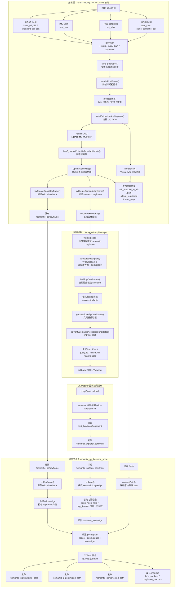

```mermaid
flowchart TD
  %% =========================
  %% 主线程 laserMapping
  %% =========================
  subgraph A["主线程：laserMapping / FAST-LIVO2 前端"]
    A0["ROS 输入回调"]
    A1["LiDAR 回调<br/>livox_pcl_cbk / standard_pcl_cbk"]
    A2["IMU 回调<br/>imu_cbk"]
    A3["RGB 图像回调<br/>img_cbk"]
    A4["语义图回调<br/>setic_cbk / static_semantic_cbk"]

    A5["缓存队列<br/>LiDAR / IMU / RGB / Semantic"]
    A6["sync_packages()<br/>多传感器时间同步"]
    A7["handleFirstFrame()<br/>首帧时间初始化"]
    A8["processImu()<br/>IMU 预积分 / 初值 / 传播"]
    A9["stateEstimationAndMapping()<br/>选择 LIO / VIO"]

    A10["handleLIO()<br/>LiDAR-IMU 状态估计"]
    A11["handleVIO()<br/>Visual-IMU 状态估计"]

    A12["filterDynamicPointsBeforeMapUpdate()<br/>动态点剔除"]
    A13["UpdateVoxelMap()<br/>静态点更新体素地图"]

    A14["发布前端结果<br/>/aft_mapped_to_init<br/>/path<br/>/cloud_registered<br/>/Laser_map"]
    A15["tryCreateOdomKeyframe()<br/>创建 odom keyframe"]
    A16["发布 /semantic_pg/keyframe"]

    A17["tryCreateSemanticKeyframe()<br/>创建 semantic keyframe"]
    A18["enqueueKeyframe()<br/>丢给回环线程"]
  end

  A0 --> A1
  A0 --> A2
  A0 --> A3
  A0 --> A4
  A1 --> A5
  A2 --> A5
  A3 --> A5
  A4 --> A5
  A5 --> A6
  A6 --> A7
  A7 --> A8
  A8 --> A9
  A9 --> A10
  A9 --> A11
  A10 --> A12
  A12 --> A13
  A13 --> A14
  A13 --> A15
  A15 --> A16
  A13 --> A17
  A17 --> A18
  A11 --> A14

  %% =========================
  %% SemanticLoopManager
  %% =========================
  subgraph B["回环线程：SemanticLoopManager"]
    B0["workerLoop()<br/>后台线程等待 semantic keyframe"]
    B1["computeDescriptors()<br/>计算语义描述子<br/>全局直方图 + 网格直方图"]
    B2["findTopCandidates()<br/>查找历史候选 keyframe"]
    B3["语义相似度筛选<br/>cosine similarity"]
    B4["geometricVerifyCandidates()<br/>几何重叠验证"]
    B5["icpVerifySemanticAcceptedCandidates()<br/>ICP-lite 验证"]
    B6["生成 LoopEvent<br/>query_id / match_id / relative pose"]
    B7["callback 回到 LIVMapper"]
  end

  A18 --> B0
  B0 --> B1
  B1 --> B2
  B2 --> B3
  B3 --> B4
  B4 --> B5
  B5 --> B6
  B6 --> B7

  %% =========================
  %% LoopConstraint 发布
  %% =========================
  subgraph C["LIVMapper 回环结果发布"]
    C0["LoopEvent callback"]
    C1["semantic id 映射到 odom keyframe id"]
    C2["组装 fast_livo/LoopConstraint"]
    C3["发布 /semantic_pg/loop_constraint"]
  end

  B7 --> C0
  C0 --> C1
  C1 --> C2
  C2 --> C3

  %% =========================
  %% Pose Graph Backend
  %% =========================
  subgraph D["独立节点：semantic_pg_backend_node"]
    D0["订阅 /semantic_pg/keyframe"]
    D1["订阅 /semantic_pg/loop_constraint"]
    D2["订阅 /path"]

    D3["onKeyframe()<br/>保存 odom keyframe"]
    D4["添加 odom edge<br/>相邻 keyframe 约束"]

    D5["onLoop()<br/>接收 semantic loop edge"]
    D6["基础门限检查<br/>score / geo_ratio / icp_fitness / 位移 / 四元数"]
    D7["添加 semantic_loop edge"]

    D8["onInputPath()<br/>保存原始前端 path"]

    D9["构建 pose graph<br/>nodes + odom edges + loop edges"]
    D10["GTSAM 优化<br/>ISAM2 或 Batch"]
    D11["发布 /semantic_pg/keyframe_path"]
    D12["发布 /semantic_pg/optimized_path"]
    D13["发布 /semantic_pg/corrected_path"]
    D14["发布 markers<br/>loop_markers / keyframe_markers"]
  end

  A16 --> D0
  C3 --> D1
  A14 --> D2

  D0 --> D3
  D3 --> D4
  D1 --> D5
  D5 --> D6
  D6 --> D7
  D2 --> D8

  D4 --> D9
  D7 --> D9
  D8 --> D9
  D9 --> D10
  D10 --> D11
  D10 --> D12
  D10 --> D13
  D10 --> D14
```
